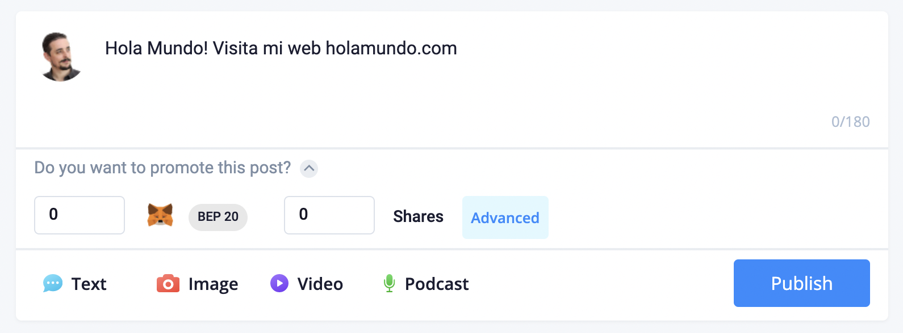
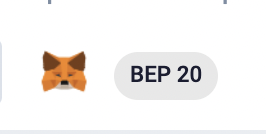
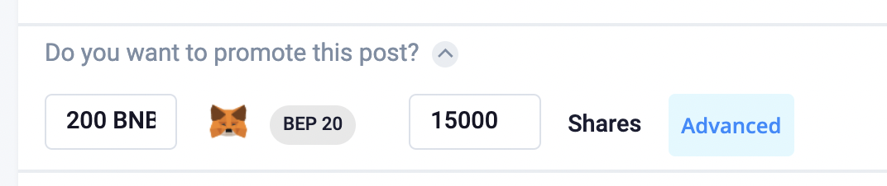
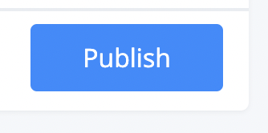

# Creación de campañas descentralizadas

Crear campañas en Woonkly es muy sencillo. Como anunciante, solo deberás seguir los siguientes pasos:

1. Crea un POST. Puede contener texto, imagen, vídeo o audio.

2. Conecta tu Metamask o Wallet Connect.

3. Elige con que Token \(BNB o WOOP\) vas a hacer tu campaña y cuántas veces quieres que vean y compartan tu contenido \(existe un mínimo de compartidos y a partir de ahí es modificable\). _Cuántos más tokens reparta un anunciante, más alto aparece en el feed de la red social de su audiencia objetivo._

4. Dale a "_Publish_" o "Publicar" y firma con tu Metamask.

5. ¡Listo! Tu post estará publicado de manera descentralizada y ¡tu campaña activa! Ahora solo quedará ver las analíticas en tu panel de análisis.

