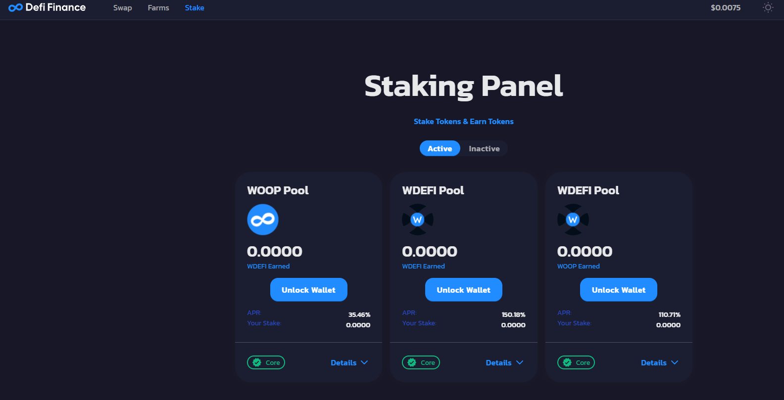

# Pool de Stake

Actualmente, los usuarios pueden realizar stake en defi.finance y conseguir así, beneficios.

En este momento en la V1.2 los tokens habilitados para realizar Stake son:

WOOP

wDEFI

Se está trabajando en la V2 la cuál tendrá más funcionalidades y pares

Dentro del Panel de Stake de Woonkly puedes bloquear tus tokens para obtener liquidez en cualquier momento desde 10 WOOP o wDEFI, pudiendo a partir de esa cantidad mínima añadir unidades individuales \(ejemplo: 100+1\). 

Los beneficios que genera el stake APR variables \(Algoritmos que dependen de la liquidez y el número de stakers en cada momento\)

