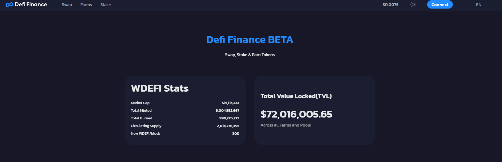
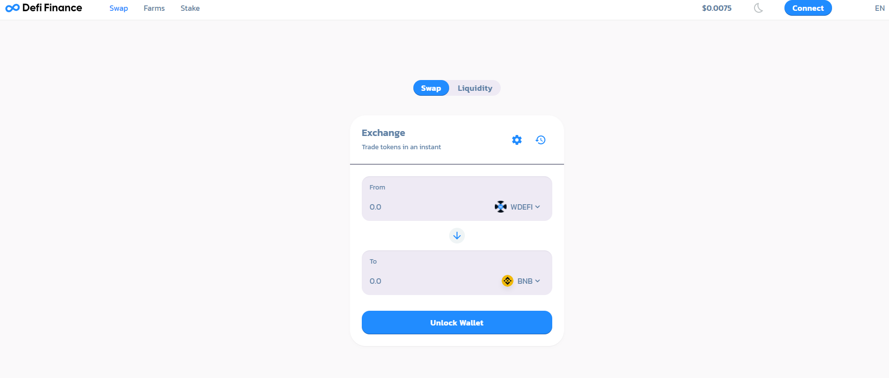
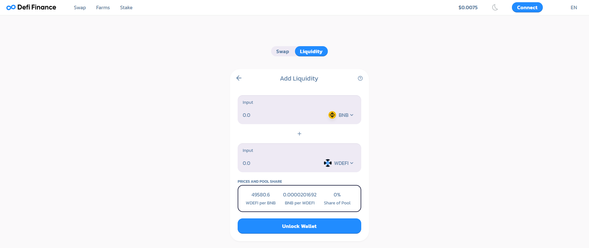
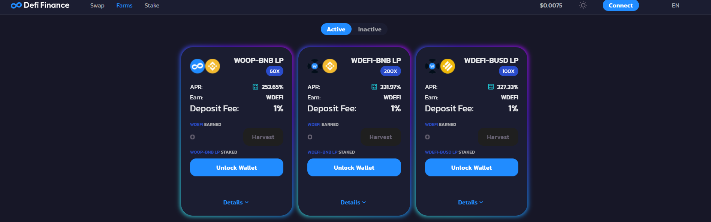

# DEFI.FINANCE V1.2

**Este protocolo es el esqueleto o "core" de tres productos de Woonkly:**

* Esta versión de defi.finance tiene su propio KYC para cumplir con las regulaciones que impone el estado
* El Swap de compra-venta del token de la plataforma "WOOP", creado sobre Binance Smart Chain. 
* El Swap de compra-venta del token de la plataforma defi.finance "wDEFI", creado sobre Binance Smart Chain.
* El DEX Multitoken / Multichain ERC20/BEP20 que permite intercambiar tokens y crear pools de liquidez dentro de la red de Ethereum y dentro de la red de Binance Smart Chain. \(En proceso - Versión V2\)
* El DEX Crosschain Puente entre Redes ERC20 y BEP20 que permite intercambiar tokens entre blockchains diferentes de manera inmediata. \(En proceso - Versión V2\)

En Defi.finance los usuarios podrán hacer swap, añadir liquidez, farmear y hacer stake.  
  
Defi.finance tiene su propio token inflacionario llamado wDEFI  el cual es el token de recompensa para los usuarios que hagan Stake y Farm.  
  
**Comisiones**  
El swap de Defi.finance tiene una comisión baja respecto a lo existente a día de hoy en el mercado, con la particularidad de que 100% de la comisión en esta V1.2 es “quemada” o usada para recomprar tokens que serán suprimidos del sistema con el objetivo de sortear la inflación.

En la página de inicio \(home\) se indica: 

Market Cap

Total Minted

Total Burned

Circulation Supply

New wDEFI/Block

 

En el apartado Swap, se puede realizar un intercambio "swap" entre los tokens del protocolo defi.finance, como también es posible, añadir y retirar liquidez, en los pares seleccionados, obteniendo un LP \( Liquidity provider\) Token asignado por agregar liquidez al protocolo.

En el apartado Farms, es posible ganar "wDEFI" que es el token nativo de la plataforma, obteniendo los beneficios según en APR disponible en cada pool.  También es posible colectar haciendo "Harvest" de los beneficios otorgados  

El APR es un algoritmo variable en función de la cantidad de liquidez existente en el pool y la cantidad de personas que se encuentran en el mismo, realizando las tareas de farming

En este momento de la V1.2 se encuentran los siguientes pools habilitados:

WOOP-BNB LP

wDEFI-BNB LP

wDEFI-BUSD LP

WOOP-BUSD LP

En el apartado Stake Panel, se puede obtener beneficios al realizar Stake. 

En este momento en la V1.2 los tokens habilitados para realizar Stake son:

WOOP

wDEFI

Se está trabajando en la V2.

