# NFT.FINANCE

Para realizar un perfil dentro Nft.finance es necesario pasar el proceso de KYC lo cual nos permite garantizar a los compradores la autenticidad.

Utilizamos dos standard para tokens no Fungibles ERC721 y ERC1155. El token ERC-1155, es un estándar de token digital creado por Witek Radomski, Andrew Cooke, Philippe Castonguay, James Therien, Eric Binet y Ronan Sandford. Este nuevo token se puede usar para crear activos fungibles y no fungibles en la blockchain. Al usar la red , los tokens ERC-1155 son seguros, intercambiables e inmunes a la piratería, y la comunidad de desarrollo puede comenzar a crear aplicaciones que integran activos ERC-1155 con plena confianza de que el estándar actual está preparado para el futuro.

Este nuevo token posee características de diseño que le dan algunas funcionalidades nuevas muy interesantes, como transferir múltiples tipos de tokens a la vez, ahorrando en costos de transacción. Con su implementación, es posible realizar comercio \(depósito en garantía / intercambios atómicos\) de múltiples tokens sobre este estándar y eliminar la necesidad de "aprobar" contratos de tokens individuales por separado. Además, como ya se mencionó, es fácil describir y mezclar múltiples tipos de tokens fungibles o no fungibles en un solo contrato.

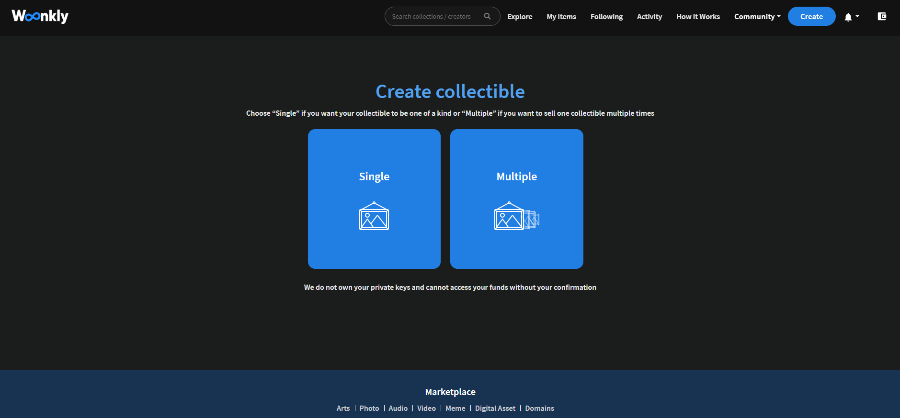

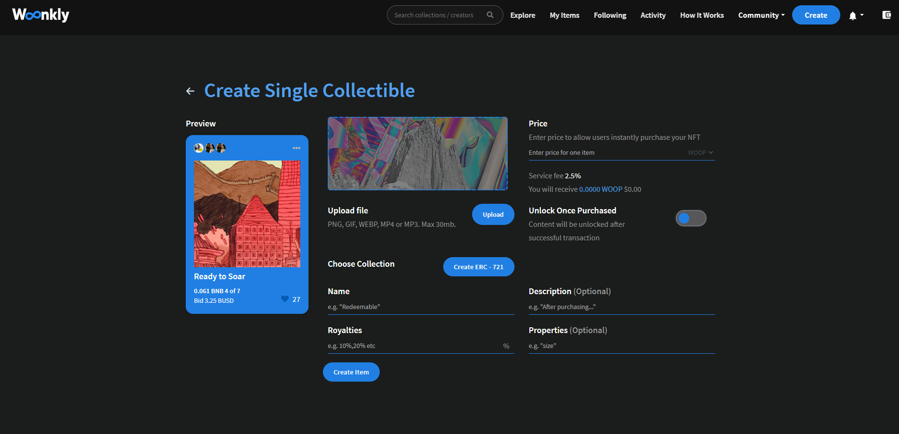

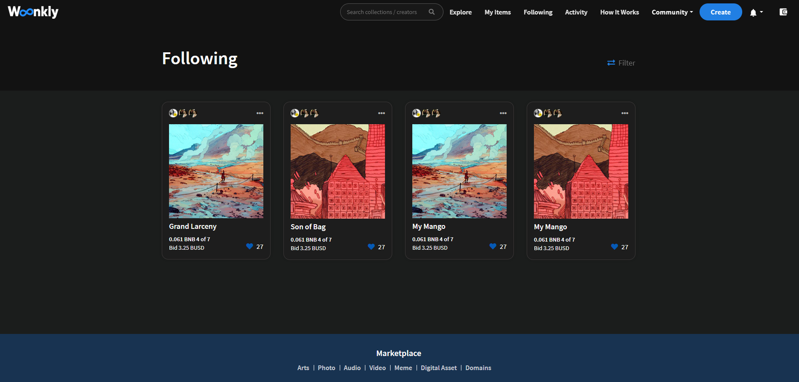

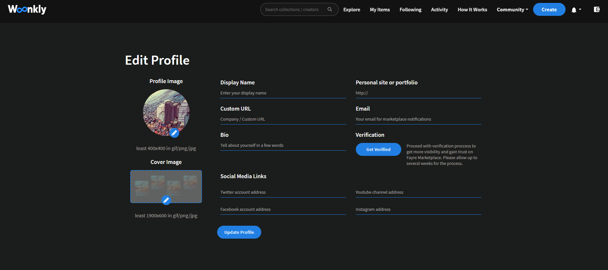

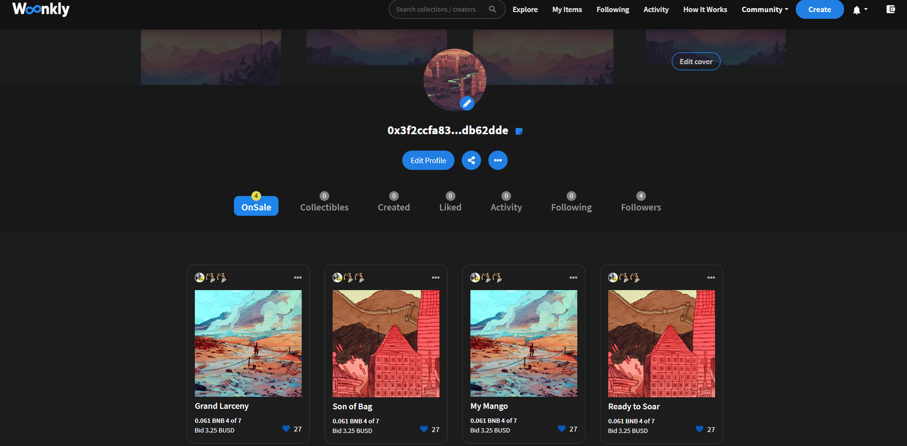

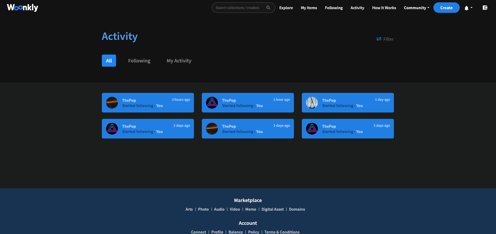

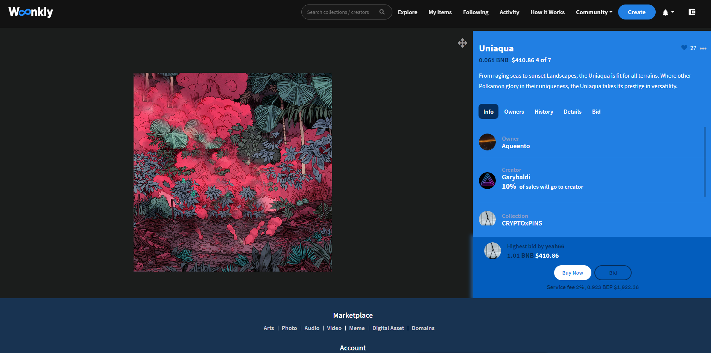

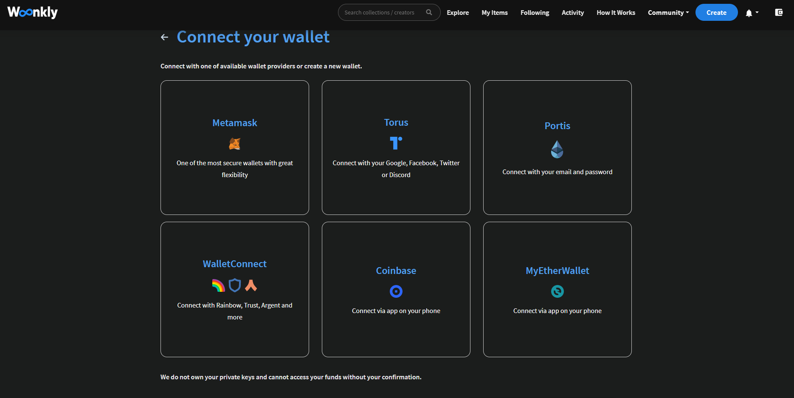

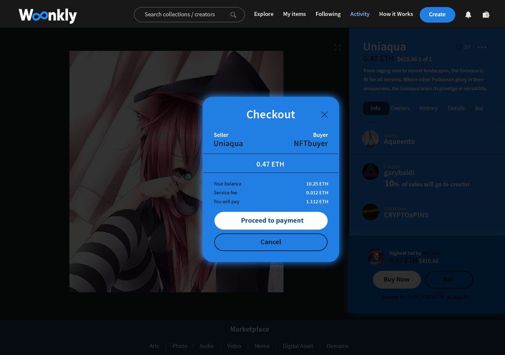

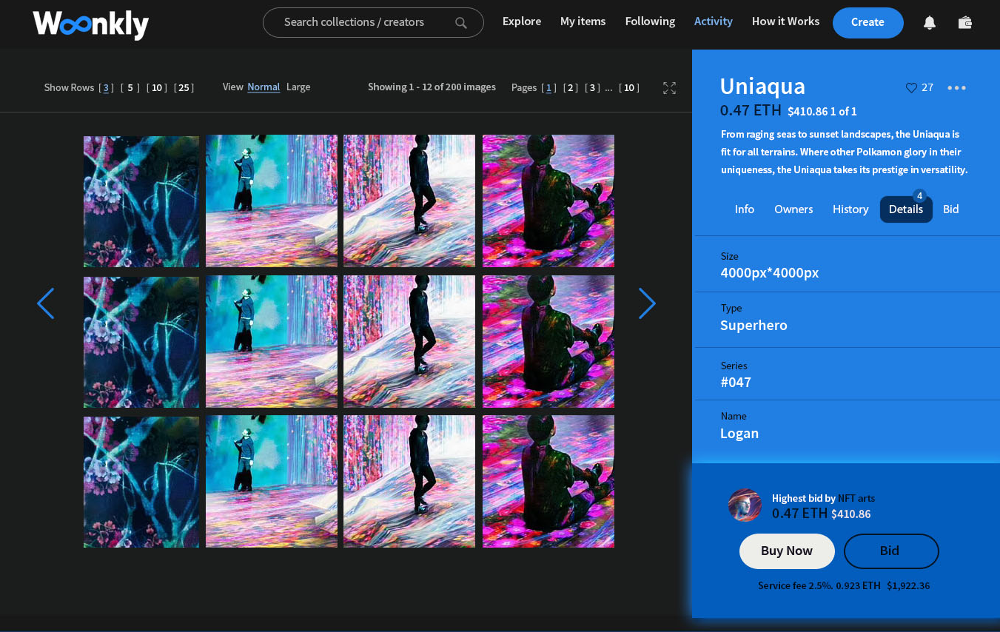

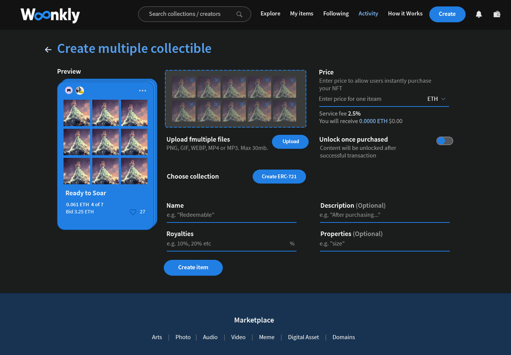

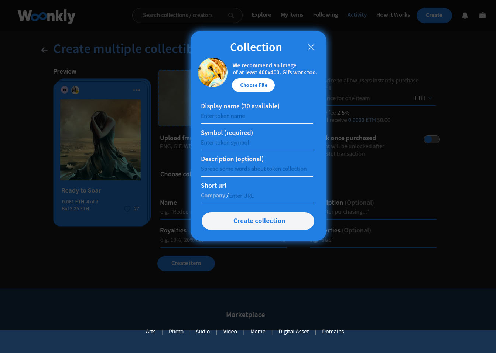

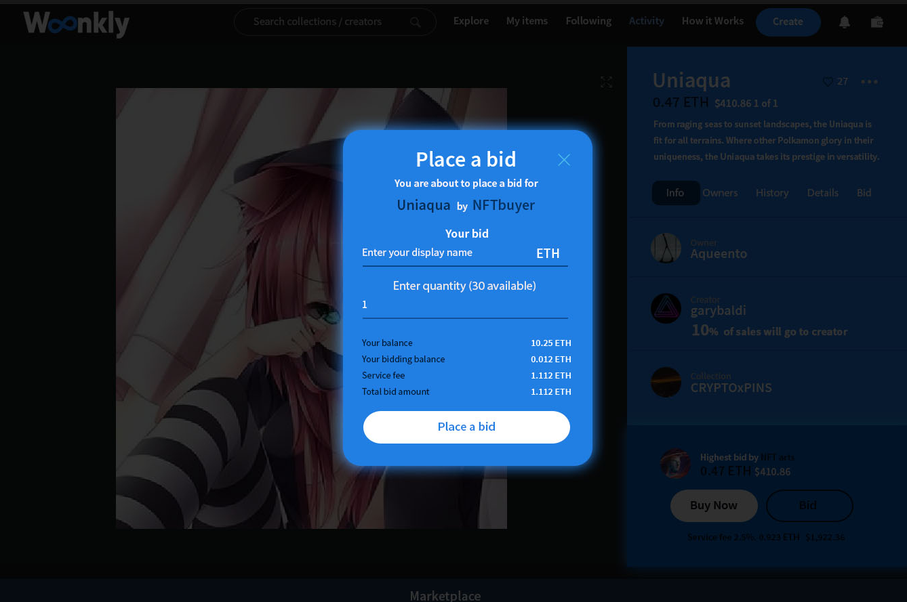

