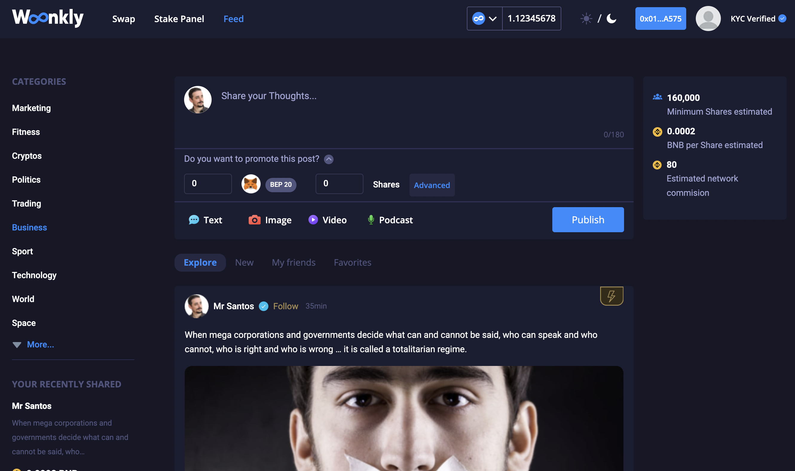
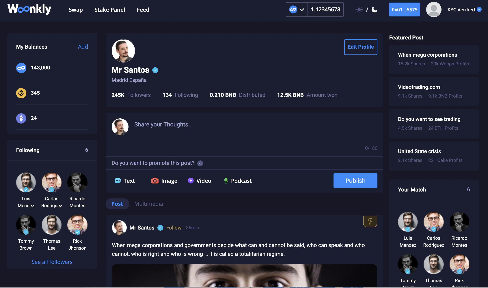
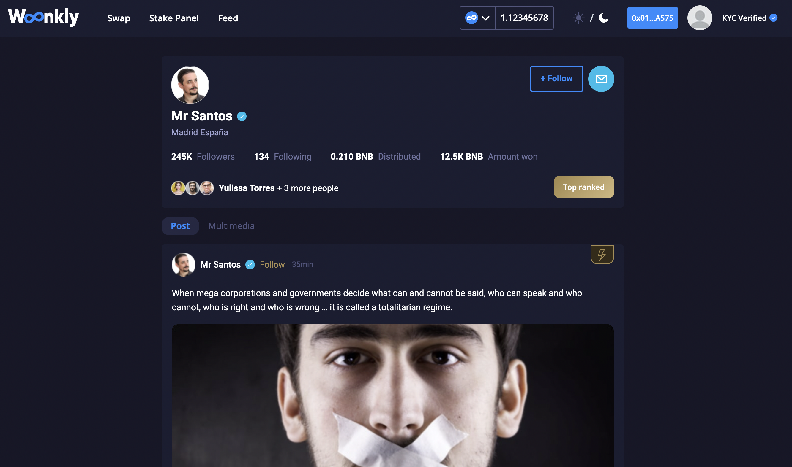

# Red Social Descentralizada \(En proceso\)

Las Redes Sociales masivas en la actualidad tienen un control total sobre los datos de los usuarios, los cuales usan para sus propios propósitos sin el consentimiento explícito del consumidor.

> **"Woonkly devuelve el poder de los datos a los usuarios".**

Toda la tecnología de la Red Social de Woonkly está siendo desarrollada en su propio Blockchain, creado en Hyperledger BESU y con conexión directa a Polkadot, Ethereum y Binance Smart Chain. 

## Beneficios de la Red Social Descentralizada de Woonkly

* Está creada 100% en Blockchain.
* Todo los datos introducidos por los usuarios pertenecen a los usuarios.
* Todo el contenido subido en la plataforma \(textos, vídeos, fotos y audios\) se aloja en Blockchain, en nuestro propio Protocolo IPFS \(Interplanetary File System\).
* El contenido de la red social serán NFTs.
* Los anunciantes pueden viralizar su contenido usando criptomonedas.
* El 80% del Capital invertido por los anunciantes en viralizar sus "posts" se reparte entre la audiencia que ve dicho contenido con simplemente compartirlo.
* El 15% del Capital invertido por los anunciantes en promocionar sus "posts" se reparte entre los "Stakers" de Woonkly. Los accionistas de Woonkly no obtienen nada por sus acciones, ya que el 100% del beneficio neto de Woonkly se reparte entre los poseedores de sus tokens.
* El 2.5% del Capital invertido por los anunciantes se reparte al comercial o afiliado que lo introdujo a la plataforma, afiliado sano \(de un solo nivel\).
* El 2.5% del Capital invertido por los anunciantes se va al fondo de operación de Woonkly.
* Los anunciantes pueden segmentar sus campañas de manera descentralizada.
* La Red Social utiliza inteligencia artificial para sugerir contenido de calidad a los usuarios, esto, conectado con Blockchain.
* Los anunciantes obtienen la publicidad más eficiente, económica y efectiva del mundo, comparada con cualquier otra plataforma existente en el mercado \(cripto o no\).
* Los usuarios ganan criptomonedas por interactuar con el contenido de los anunciantes, lo que genera refuerzos positivos subconscientes sobre las marcas de los anunciantes.
* Los usuarios eligen cómo, cuándo y dónde ven el contenido.

