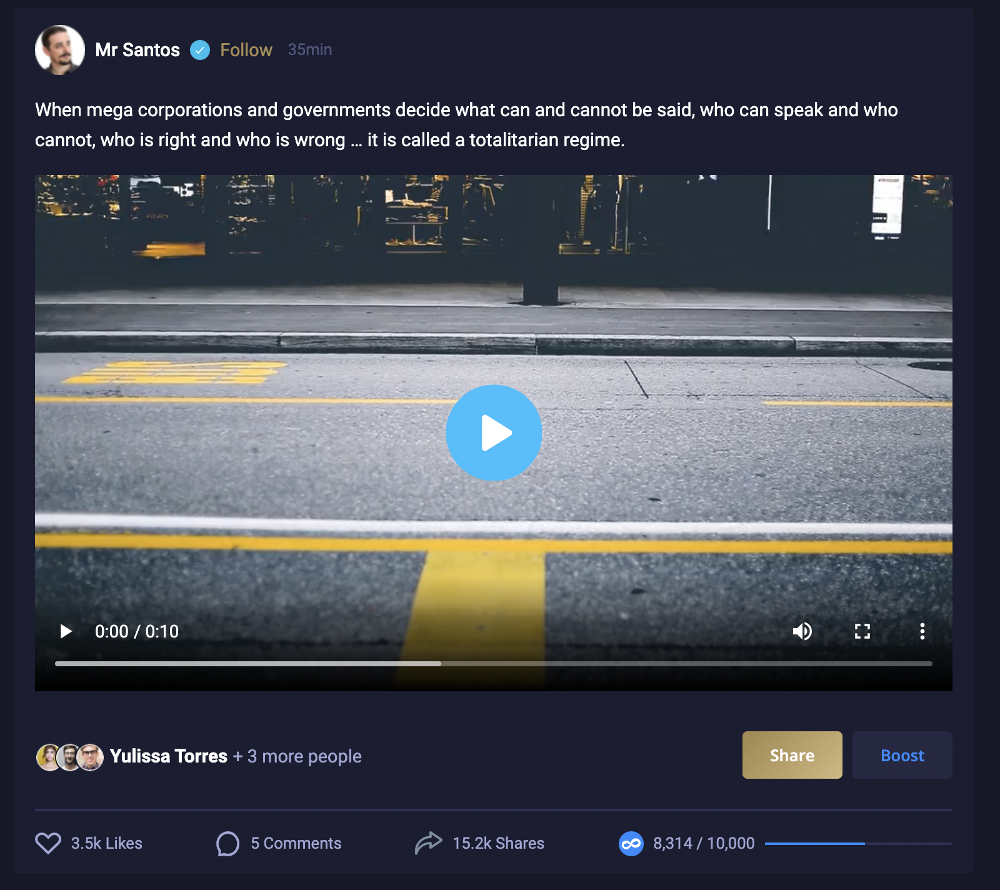
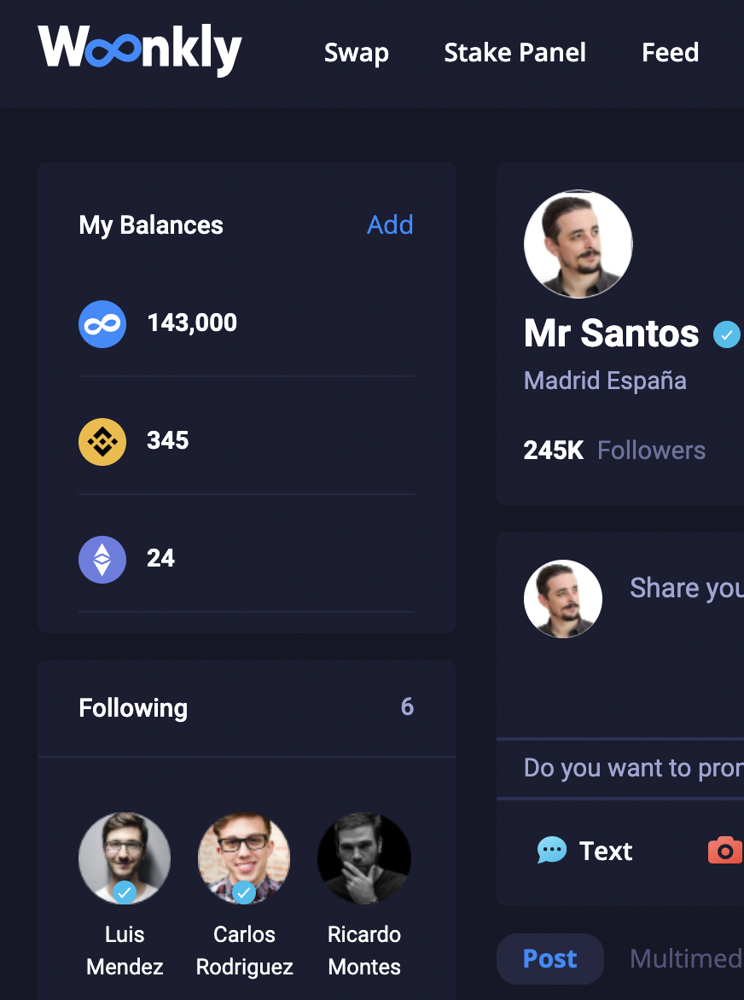

# Gana Tokens BEP20 compartiendo contenido

Los usuarios podrán usar la Red Social Descentralizada de Woonkly simplemente creando su perfil descentralizado y conectando su  Metamask/Wallet Connect.

 Cuando un usuario visualiza un post \(texto, vídeo, imagen o audio\) tiene la posibilidad de ganar tokens compartiendo el contenido en su perfil de Woonkly que será visible para todos sus seguidores y amigos.

Los posts que reparten tokens por compartirlos tienen un color dorado en el botón "Share" o "Compartir" para poder ser identificados y el propio post indica en la parte inferior derecha la cantidad de tokens que tiene dicho post/smart contract por repartir.


Toda la interacción en la Red Social se basa en Smart Contracts y funciona sobre nuestra propia Blockchain \(Woonkly Smart Chain\) por lo que no genera costo de gas para los usuarios. El único costo de gas generado recae en los anunciantes cuando quieren crear campañas, que las hacen a través de la red de Binance Smart Chain.


Los usuarios podrán ver sus tokens ganados directamente en su perfil y pueden retirarlos en cualquier momento a la red de Binance Smart Chain \(su Metamask o Wallet Conenct\), incurriendo en un costo de gas para el usuario. Se recomienda retirar los tokens ganados cuando el costo de gas sea inferior al retiro a realizar.

