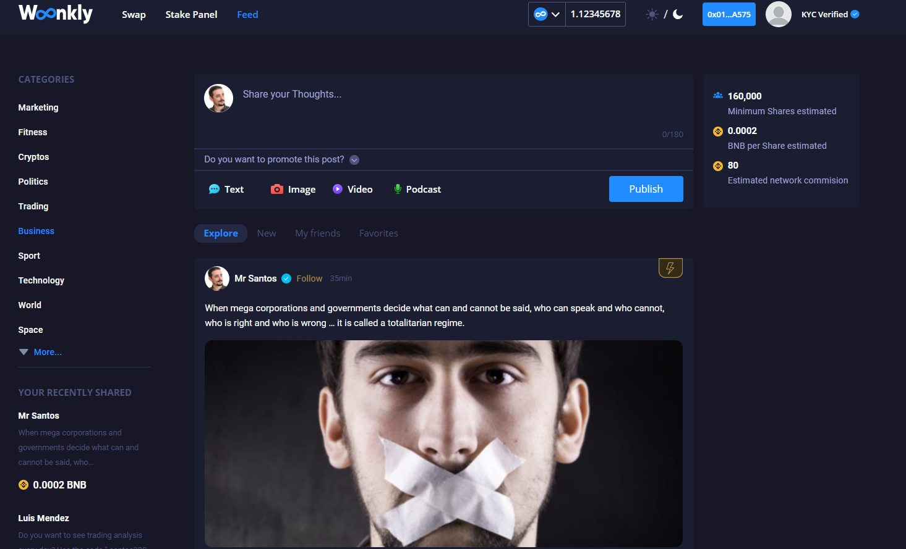
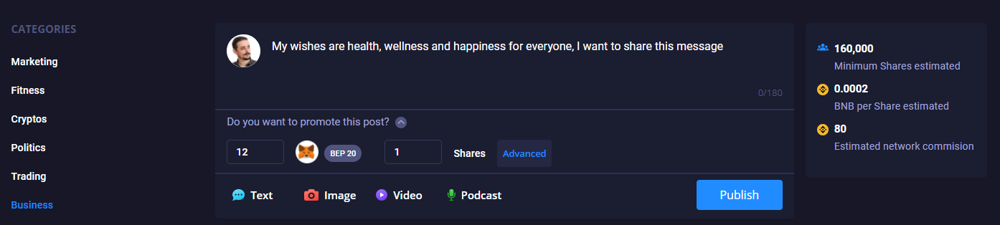
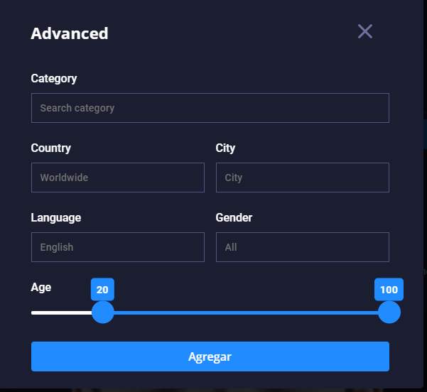
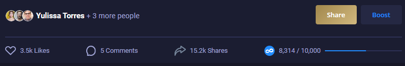
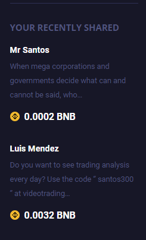
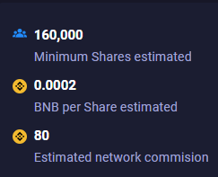
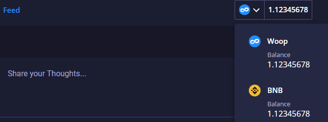

# Red Social Descentralizada \(En proceso\)

Woonkly está desarrollando una red social descentralizada que verá la luz aproximadamente Julio de 2021 en su versión 1.0. 

Toda la red social funciona sobre nuestra propia Blockchain.

Cuando un usuario publica un post deberá firmar con su Metamask, ya que para publicar cada post se despliega un Smart Contract que interactúa con la Woonkly Smart Chain. Los textos, fotos, vídeos y audios se alojan dentro de la red IPFS. 

Los anunciantes pueden hacer publicidad de sus publicaciones al conectar su Metamask a la red de Binance Smart Chain y viralizar su contenido al añadir tokens BNB o WOOP BEP20. Los usuarios pueden ganar esos tokens si visualizan y comparten el contenido de los anunciantes. 


Cuando un anunciante añade tokens para viralizar su contenido tendrá que pagar una comisión de gas en BNB BEP20 que deberá tener en su Metamask/Wallet connect. Podrá hacer campañas con BNB BEP20 y WOOP BEP20 en principio. Progresivamente se irán añadiendo nuevos tokens de la red BEP20 para poder hacer campañas.


Todo esto genera unas completas analíticas para el anunciante , en las que se refleja  qué tipo de personas han visto su post, cuándo lo vieron y compartieron, qué gustos tienen, preferencias, etc, pero siempre manteniendo el anonimato de los usuarios.

Los usuarios además están en control de todos sus datos, ya que en lugar de estar alojados en una base de datos, están alojados en Woonkly Smart Chain \(Blockchain de Woonkly\). Cualquier usuario podrá comercializar sus datos directamente vendiéndoselos a los anunciantes lo que le da a los usuarios el control total sobre su información.


La Red Social Descentralizada de Woonkly se lanzará aproximadamente en Julio del 2021 y funcionará sobre la red de Woonkly Smart Chain, Binance Smart Chain u otra según el funcionamiento y eficiencia de las mismas.


