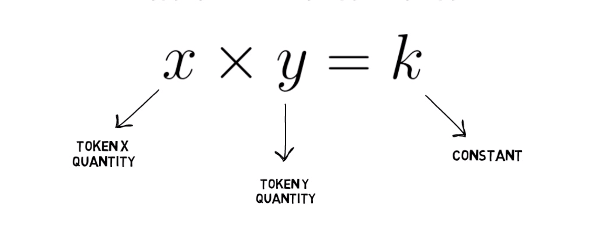
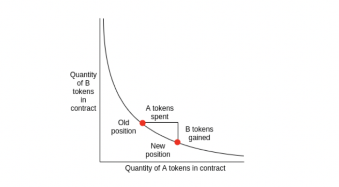

# Introducción al swap

En Woonkly.com puedes comprar y vender nuestro token "WOOP" creado sobre la Red de Binance Smart Chain \(Bep20\) de manera descentralizada. Los usuarios pueden aportar actualmente en defi.finance liquidez al Pool y con ello obtener un porcentaje de las ganancias que se generen en el Swap.

Esta tecnología tambien es usada en nuestro DEX ERC20/BEP20 que se encuentra actualmente en desarrollo y será finalizado en este 2021 y en nuestro DEX Crosschain ERC20/BEP20, que permitirá a los usuarios intercambiar cualquier token de la red ERC20 con cualquier token de la red BEP20 y viceversa

\*Todos nuestros productos y/o servicios serán orientados a cumplir con las regulaciones impuestas por la Unión Europea

## Exchange descentralizado de liquidez constante 

## ¿Por qué está automatizado el DEX?

¿Por qué automatizado? Woonkly utiliza un creador de mercado automatizado en lugar de una microestructura más tradicional por varias razones:

**Resuelve el problema de emparejamiento comprador / vendedor:** El creador de mercado automatizado garantiza que el mercado siempre está disponible para operar, incluso a las dos de la mañana en su zona horaria local, al inicio del mercado, e incluso si no hay otros comerciantes activos en ese momento. Al dar a los comerciantes la confianza de que pueden obtener liquidez para sus apuestas cuando lo deseen, los creadores de mercado automatizados crean incentivos adicionales para participar. 

**Habilita grandes mercados con muchos eventos:** Considere un mercado de predicciones sobre qué candidato presidencial de Estados Unidos ganará las elecciones. Posiblemente, podría haber docenas de diferentes candidatos negociados activamente, sujetos a la restricción de que sus probabilidades acumuladas no pueden sumar más del 100%. Estos grandes espacios de eventos son muy difíciles de sembrar para los participantes humanos, lo que requiere estimaciones de probabilidad cuidadosas y precisas para valores muy pequeños. En consecuencia, los mercados existentes de predicción mediada por humanos con un gran número de resultados tienden a tener márgenes de oferta / demanda muy amplios, especialmente para los candidatos más oscuros. Los creadores de mercado automatizados mitigan este problema, teniendo un comportamiento consistente en mercados con grandes o pequeños números de resultados. 

**Expresa de forma concisa el estado actual del mercado:** Una de las preocupaciones en un sistema distribuido como Augur es que cada parte del estado compartido aumenta la posibilidad de inconsistencias entre las opiniones de varios participantes y aumenta la cantidad de tiempo para que las diferentes vistas del mercado se alineen. Los creadores de mercado automatizados pueden integrarse y distribuirse con una cantidad mínima de estado. Esto puede contrastarse con una subasta doble tradicional en la que el estado de mercado completo incluye toda la cartera de pedidos y donde las operaciones pueden incluir que los participantes retiren o modifiquen sus pedidos existentes. 

**Permite un control preciso de las pérdidas en el peor de los casos por parte de los aportadores de liquidez del mercado:** El iniciador de un mercado asume el riesgo de perder una cantidad determinada \(que siempre puede aumentar\) a cambio de un pago variable derivado de las tarifas comerciales. A medida que aumenta la cantidad arriesgada por el patrocinador, el mercado se vuelve más profundo y las acciones individuales provocan menos deslizamientos en los precios. Un resultado interesante de este límite es que los mercados pueden entrar en estados de ganancias incondicionales para sus patrocinadores, en los que un mercado activo ha recaudado suficientes tarifas comerciales para hacer que el mercado sea rentable para su patrocinador independientemente de las apuestas futuras e independientemente del resultado que realmente tenga lugar. 

**Los creadores de mercado automatizados evitan errores comunes de los operadores y la redundancia de información:** Los estudios de investigación han demostrado que los comerciantes de los Mercados Electrónicos de Iowa \(IEM, por sus siglas en inglés\) a menudo violan la "ley del precio único". Considere apostar por cuál de los dos candidatos. Lógicamente, una apuesta a que el candidato A gane las elecciones equivale a una apuesta a que el candidato B gane. Sin embargo, en las tradicionales subastas dobles, los precios de estos contratos pueden divergir y, además, los administradores del IEM observaron que muchos comerciantes toman posiciones en el peor contrato irracional. Por el contrario, los creadores de mercado automatizados imponen la igualdad de apuestas lógicamente equivalentes.

**defi.finance es un creador de mercado automatizado \(AMM\)**. Puede pensar en un AMM como un creador de mercado robótico primitivo que siempre está dispuesto a cotizar precios entre dos activos de acuerdo con un algoritmo de precios simple. defi.finance fija el precio de los dos activos de modo que el número de unidades que tiene de cada activo, multiplicado, sea siempre igual a una constante fija. Eso es un poco complicado: si  defi.finance posee algunas unidades del token x y algunas unidades del token y, fija el precio de cualquier operación de modo que las cantidades finales de x e y que posee, multiplicadas juntas, son iguales a una constante fija, k. Esto se formaliza como la ecuación del producto constante: x \* y = k. 

