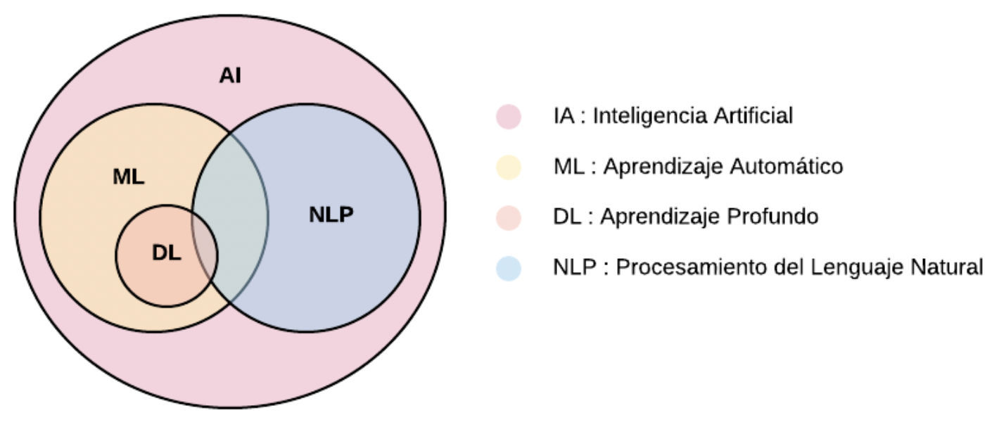
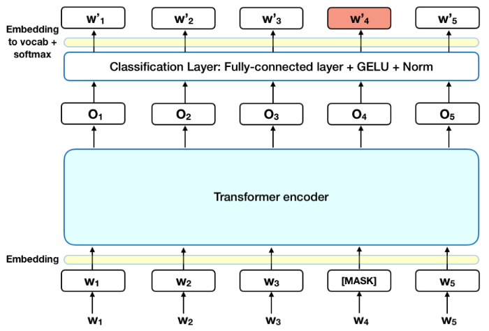

# Algoritmo Red Social Woonkly

Para ser objetivos con la audiencia, el contenido y los datos, estamos desarrollando modelos de Procesamiento de Lenguaje Natural, que es una rama dentro de Machine Learning, en el campo de la Inteligencia Artificial. 

Estos algoritmos permiten tener una mayor compresión de los datos, personalizar campañas con determinado público objetivo a través de una poderosa segmentación y personalizar la experiencia del usuario a un nivel muy alto.

Utilizamos BERT y estamos experimentando con GPT-2

{% embed url="https://es.wikipedia.org/wiki/BERT\_\(sistema\_computacional\_de\_comprensi%C3%B3n\_de\_lenguaje\)" %}

En particular, lo que hace que este nuevo modelo sea mejor es que puede **comprender los pasajes** dentro de los documentos de la misma manera que **BERT** comprende palabras y oraciones, lo que permite al algoritmo comprender documentos más largos.

### Aclaremos primero qué es un pasaje en una página web

Según **Martin Splitt** de Google, un pasaje es una parte específica dentro de un documento \(url, post, página de producto, página\) donde el algoritmo intentará entender el documento por partes y _poder calificar diferentes partes de una página de forma independiente_.

**Los pasajes** están diseñados por Google para entender esas páginas, post, etc. súper largas, donde hay mucho contenido y donde, tal vez, a diferentes usuarios solo les interesa saber una parte de ese contenido, por lo tanto, no tienen por qué leer \(o buscar\) todo el texto.

> ## Cómo funciona BERT 
>
> BERT utiliza Transformer, un mecanismo de atención que aprende las relaciones contextuales entre palabras \(o subpalabras\) en un texto. En su forma básica, Transformer incluye dos mecanismos separados: un codificador que lee la entrada de texto y un decodificador que produce una predicción para la tarea. Dado que el objetivo de BERT es generar un modelo de lenguaje, solo es necesario el mecanismo del codificador. El funcionamiento detallado de Transformer se describe en un [documento](https://arxiv.org/pdf/1706.03762.pdf) de Google.
>
> A diferencia de los modelos direccionales, que leen la entrada de texto secuencialmente \(de izquierda a derecha o de derecha a izquierda\), el codificador Transformer lee la secuencia completa de palabras a la vez. Por lo tanto, se considera bidireccional, aunque sería más exacto decir que no es direccional. Esta característica permite que el modelo aprenda el contexto de una palabra en función de todo su entorno \(izquierda y derecha de la palabra\).
>
> La siguiente tabla es una descripción de alto nivel del codificador transformador. La entrada es una secuencia de tokens que primero se incrustan en vectores y luego se procesan en la red neuronal. La salida es una secuencia de vectores de tamaño H, en la que cada vector corresponde a un token de entrada con el mismo índice.
>
> Al entrenar modelos de lenguaje, existe el desafío de definir un objetivo de predicción. Muchos modelos predicen la siguiente palabra en una secuencia \(por ejemplo, "El niño llegó a casa de \_\_\_"\), un enfoque direccional que limita inherentemente el aprendizaje del contexto. Para superar este desafío, BERT utiliza dos estrategias de capacitación:
>
> ### LM enmascarado \(MLM\) 
>
> Antes de introducir secuencias de palabras en BERT, 15% de las palabras de cada secuencia se reemplazan con un token \[MASK\]. Luego, el modelo intenta predecir el valor original de las palabras enmascaradas, basándose en el contexto proporcionado por las otras palabras no enmascaradas en la secuencia. En términos técnicos, la predicción de las palabras de salida requiere:
>
> 1. Agregar una capa de clasificación sobre la salida del codificador.
> 2. Multiplicar los vectores de salida por la matriz de incrustación, transformándolos en la dimensión de vocabulario.
> 3. Calcular la probabilidad de cada palabra del vocabulario con softmax.

### Predicción de la siguiente oración \(NSP\) 

En el proceso de entrenamiento de BERT, el modelo recibe pares de oraciones como entrada y aprende a predecir si la segunda oración del par es la oración subsiguiente en el documento original. Durante el entrenamiento, 50% de las entradas son un par en el que la segunda oración es la oración posterior en el documento original, mientras que en el otro 50% se elige una oración aleatoria del corpus como segunda oración. El supuesto es que la oración aleatoria se desconectará de la primera oración.

Para ayudar al modelo a distinguir entre las dos oraciones en entrenamiento, la entrada se procesa de la siguiente manera antes de ingresar al modelo:

1. Se inserta un token \[CLS\] al principio de la primera oración y un token \[SEP\] al final de cada oración.
2. A cada ficha se agrega una inserción de oración que indica la oración A o la oración B. Las incrustaciones de oraciones son similares en concepto a las incrustaciones de fichas con un vocabulario de 2.
3. Se agrega una incrustación posicional a cada token para indicar su posición en la secuencia. El concepto y la implementación de la incrustación posicional se presentan en el artículo de Transformer.

Para predecir si la segunda oración está realmente conectada con la primera, se realizan los siguientes pasos:

1. Toda la secuencia de entrada pasa por el modelo Transformer.
2. La salida del token \[CLS\] se transforma en un vector con forma de 2 × 1, utilizando una capa de clasificación simple \(matrices aprendidas de pesos y sesgos\).
3. Cálculo de la probabilidad de IsNextSequence con softmax.

Al entrenar el modelo BERT, Masked LM y Next Sentence Prediction se entrenan juntos, con el objetivo de minimizar la función de pérdida combinada de las dos estrategias.

## Conclusión 

BERT es, sin duda, un gran avance en el uso del aprendizaje automático para el procesamiento del lenguaje natural. El hecho de que sea accesible y permita un ajuste fino rápido, probablemente permitirá una amplia gama de aplicaciones prácticas en el futuro. En este resumen, intentamos describir las ideas principales del artículo sin ahogarnos en detalles técnicos excesivos. Para aquellos que deseen una inmersión más profunda, recomendamos leer el artículo completo y los artículos auxiliares a los que se hace referencia en él. Otra referencia útil es el [código fuente](https://github.com/google-research/bert) y los modelos de [BERT](https://github.com/google-research/bert) , que cubren 103 idiomas y fueron generosamente liberados como código abierto por el equipo de investigación.

Credits : [https://towardsdatascience.com/bert-explained-state-of-the-art-language-model-for-nlp-f8b21a9b6270](https://towardsdatascience.com/bert-explained-state-of-the-art-language-model-for-nlp-f8b21a9b6270)

