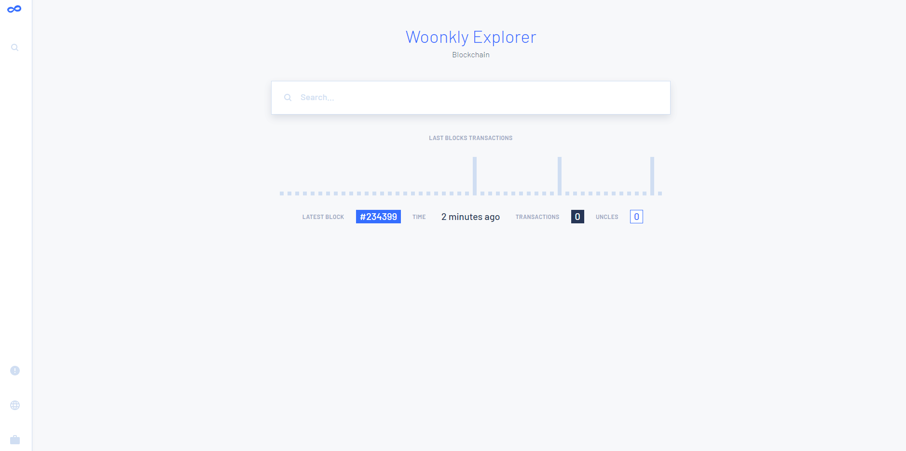
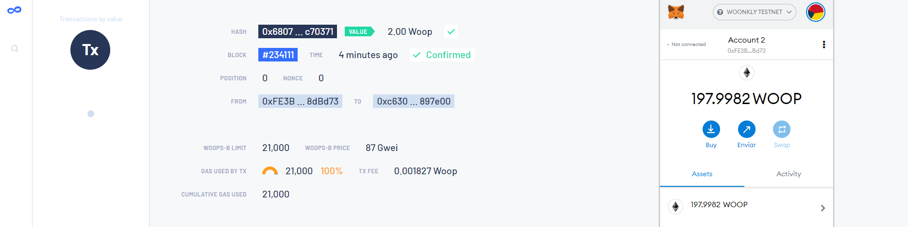
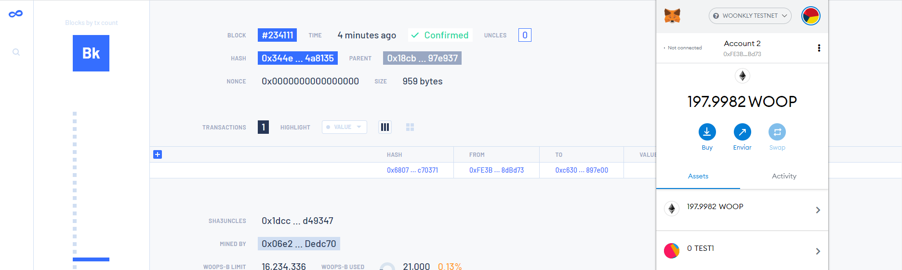

# Conectando Metamask a Woonkly Testnet

#### Testnet \( Red de pruebas \) 

**Network Name: Woonkly Testnet**

**New RPC URL:** [**http://18.157.169.185:8545**](http://18.157.169.185:8545)\*\*\*\*

**ChainID:** 218

**Symbol:** WOOPt

**Block Explorer URL:** [**http://18.157.169.185:25000**](http://18.157.169.185:25000)\*\*\*\*

\*\*\*\*

