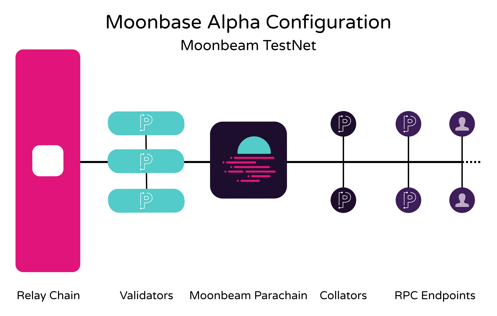

# Conectando Woonkly a Polkadot

Network Name: `Moonbase Alpha`

New RPC URL: `https://rpc.testnet.moonbeam.network`

ChainID: `1287`

Symbol \(Optional\): `DEV`



## Moonbase Alpha Faucet <a id="moonbase-alpha-faucet"></a>

[https://docs.moonbeam.network/getting-started/testnet/faucet/](https://docs.moonbeam.network/getting-started/testnet/faucet/)

#### HTTPS DNS <a id="https-dns"></a>

To connect to Moonbase Alpha via HTTPS, simply point your provider to the following RPC DNS:

```text
https://rpc.testnet.moonbeam.network
```

#### WSS DNS <a id="wss-dns"></a>

For WebSocket connections, you can use the following DNS:

```text
wss://wss.testnet.moonbeam.network
```

