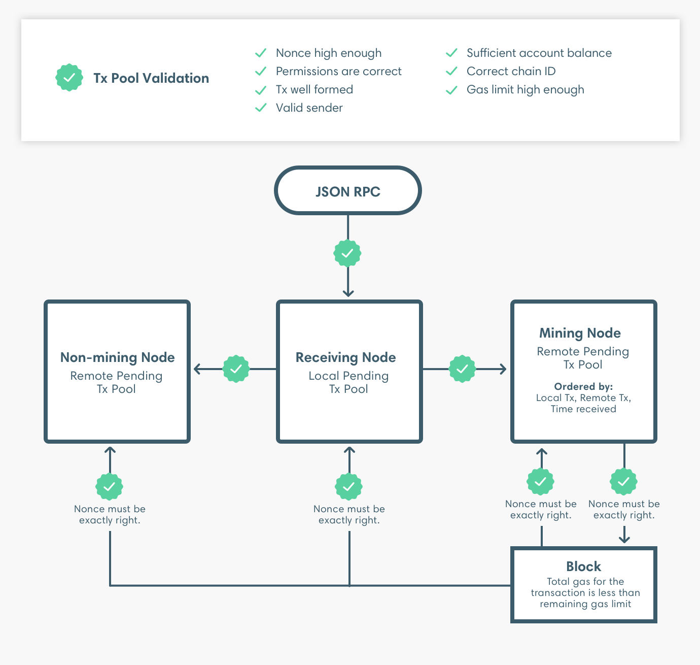

# Validación de transacciones

Se repite el conjunto de validaciones del pool de transacciones después de propagar la transacción. 

También repite el mismo conjunto de validaciones al importar el bloque que incluye la transacción, excepto que el nonce debe ser exactamente correcto al importar el bloque.

Al añadir la transacción a un bloque, se realiza una validación adicional para comprobar que el límite de gas de la transacción es menor que el límite de gas del bloque restante. Después de crear un bloque, el nodo importa el bloque y luego repite las validaciones del gas de transacción.

#### Importante

La transacción sólo se añade si todo el límite de gas de la transacción es menor que el gas restante del bloque. El gas total utilizado por la transacción no es relevante para esta validación. Es decir, si el gas total utilizado por la transacción es menor que el gas restante del bloque, pero el límite de gas de la transacción es mayor que el gas restante del bloque, la transacción no se añade.

