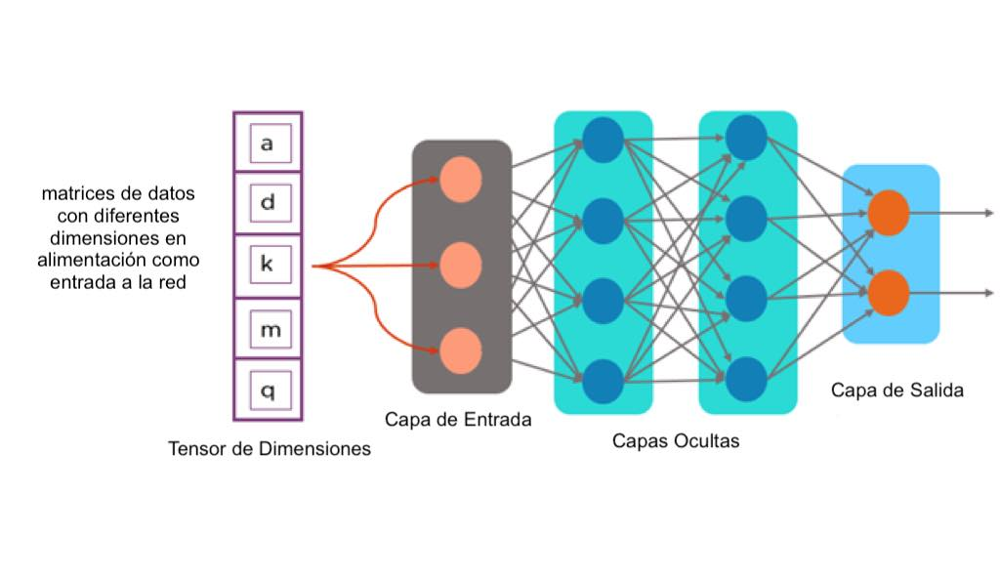
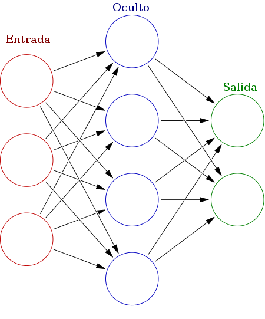
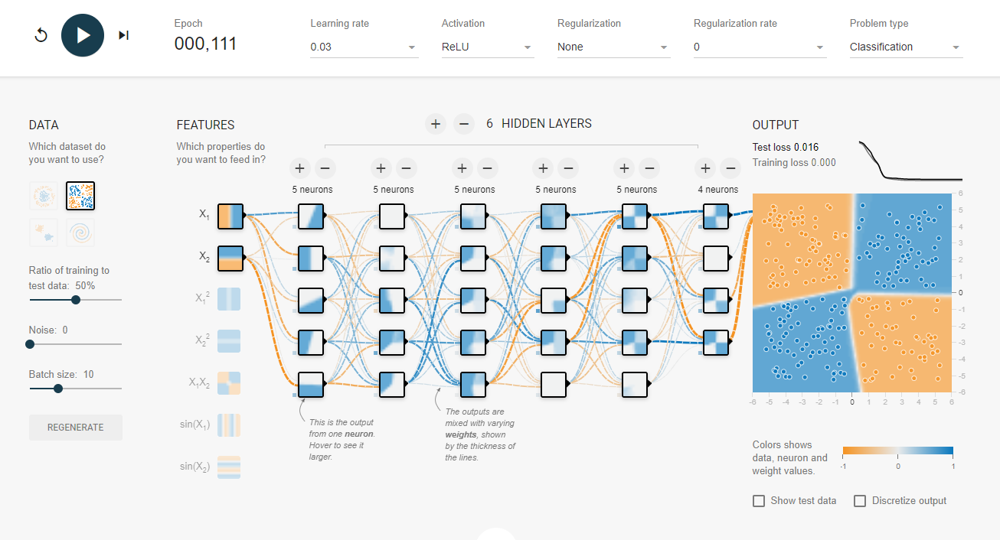

# Machine Learning - Redes neuronales

Woonkly utiliza Tensorflow, herramienta que fue denominada así porque funciona por el flujo de tensores en forma de un **gráfico computacional**.

Los tensores son básicamente matrices multidimensionales.

Un gráfico computacional tiene una red de nodos y cada nodo realiza una operación como la suma, la multiplicación o la evaluación de alguna ecuación multivariada.

Los nodos representan operaciones matemáticas y los bordes representan tensores.

TensorFlow se puede usar para construir cualquier tipo de algoritmos de aprendizaje profundo como:

* CNN
* RNN
* DBN
* FeedForward Neural Network
* Algoritmos para procesamiento de lenguaje natural
* Otros

Hay varios elementos de programación en TensorFlow como constantes, variables, marcadores de posición, sesiones, etc.

Cada uno tiene tiene sus propias funcionalidades y se usa para construir cualquier modelo de Deep Learning.

Tensoflow utiliza Python para proporcionar una API front-end conveniente para crear aplicaciones con el framework, mientras ejecuta aplicaciones en C++ de alto rendimiento.

Woonkly utiliza TensorFlow, de esa manera puede “aprender” y ejecutar “Redes Neuronales” profundas para:

* Clasificar textos escritos a mano
* Hacer reconocimiento de imágenes
* Palabras incrustadas
* Redes neuronales recurrentes
* Modelos de secuencia a secuencia para traducción automática
* Procesamiento de lenguaje natural
* Simulaciones basadas en PDE \(ecuación diferencial parcial\).

Puedes realizar pruebas de cómo funciona el algoritmo aquí:

[https://playground.tensorflow.org/](https://playground.tensorflow.org/)

[https://www.tensorflow.org/](https://www.tensorflow.org/)

