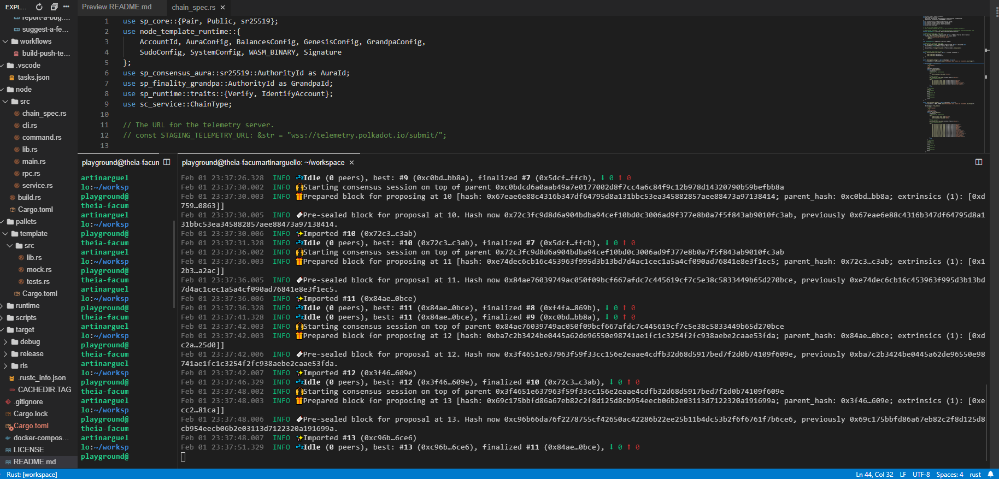

# Polkadot - Interoperatividad

## Por qué nos basamos en Polkadot para la red social descentralizada 

Después de una extensa investigación, decidimos conectar utilizar polkadot como una de las herramientas para la red social de Woonkly usando el marco de desarrollo de Substrate y, en el futuro, desplegar Woonkly como una parachain en la red Polkadot, lo que nos otorga una interoperatividad de costo de gas 0 dentro de la red social.

### Marco de Blockchain de Substrate 

Al construir sobre este marco, podemos aprovechar la amplia funcionalidad que Substrate incluye lista para usar, en lugar de tener que construirla nosotros mismos. Esto incluye redes peer-to-peer, mecanismos de consenso, funcionalidad de gobernanza, una implementación de EVM y más.

En general, el uso de Substrate reducirá drásticamente el tiempo y el esfuerzo de implementación necesarios para nuestra blockchain. Substrate permite un gran grado de personalización, que es necesario para lograr nuestros objetivos de compatibilidad con Ethereum. Y, al utilizar Rust, nos beneficiamos tanto de las garantías de seguridad como de las mejoras de rendimiento.

### Red y ecosistema de Polkadot 

La red Polkadot también se adapta bien. Como paracadena en Polkadot, podremos integrarnos directamente y mover tokens entre cualquier otra paracadena y parathreads en la red.

También podemos aprovechar cualquiera de los puentes que se construyen de forma independiente para conectar cadenas que no son de Polkadot a Polkadot, incluidos los puentes a Ethereum. El modelo de interoperabilidad de Polkadot respalda de manera única los objetivos de integración entre cadenas y es una tecnología habilitadora clave.

### Utilizaremos Moonbeam integrando compatibilidad EVM al marco Polkadot

## Tecnología 

### La pila de desarrollo Moonbeam 

Moonbeam es una plataforma de cadena de bloques de contrato inteligente construida en el lenguaje de programación Rust, utilizando el marco Substrate.

#### Lenguaje de programación Rust 

Rust es un buen lenguaje para implementar una cadena de bloques, ya que tiene un alto rendimiento como C y C ++, pero tiene características de seguridad de memoria integradas que se aplican en el momento de la compilación, lo que evita muchos errores comunes y problemas de seguridad que pueden surgir de C y C ++ implementaciones.

#### Marco de sustrato 

Substrate proporciona un amplio conjunto de herramientas para crear cadenas de bloques, incluido un entorno de ejecución en tiempo de ejecución que habilita una función de transición de estado genérica y un conjunto de módulos conectables que proporcionan implementaciones de varios subsistemas de cadenas de bloques.

Moonbeam aprovecha múltiples paletas de marcos de sustrato existentes para proporcionar servicios y funcionalidad clave de blockchain, incluidas las estructuras de datos centrales de blockchain, redes peer-to-peer, mecanismos de consenso, cuentas, activos y saldos. Las paletas personalizadas y la lógica en el tiempo de ejecución implementan el comportamiento y la funcionalidad específicos de Moonbeam, como la integración de token entre cadenas. Para los pallets apalancados, Moonbeam se esforzará por permanecer lo más cerca posible de la base de código de Substrate ascendente e incorporará correcciones de errores de Substrate, mejoras y nuevas funciones de forma continua.

### Tiempo de ejecución de Blockchain 

El tiempo de ejecución principal de Moonbeam especifica la función de transición de estado y el comportamiento de la cadena de bloques Moonbeam. El tiempo de ejecución de Moonbeam se construye usando [FRAME](https://docs.moonbeam.network/resources/glossary/#substrate-frame-pallets) . Incluye varios paletts estándar así como varios personalizados. El tiempo de ejecución se compila en un binario [WebAssembly \(Wasm\)](https://docs.moonbeam.network/resources/glossary/#webassemblywasm) y en un binario nativo. Estas versiones compiladas se ejecutarán en los entornos de nodo Polkadot Relay Chain y Moonbeam

#### Tecnológicamente, estamos trabajando en interoperatividad real descentralizada.

### Arquitectura de compatibilidad de Ethereum 

Los contratos inteligentes en Moonbeam se pueden implementar utilizando Solidity, Vyper y cualquier otro lenguaje que pueda compilar contratos inteligentes en un código de bytes compatible con EVM. Moonbean tiene como objetivo proporcionar un entorno seguro y de baja fricción para el desarrollo, la prueba y la ejecución de contratos inteligentes que sea compatible con la cadena de herramientas para desarrolladores de Ethereum existente.

El comportamiento de ejecución y la semántica de los contratos inteligentes basados ​​en Moonbeam se esforzarán por estar lo más cerca posible de Ethereum Layer 1. Moonbeam es un solo fragmento, por lo que las llamadas de contrato cruzado tienen la misma semántica de ejecución sincrónica que en Ethereum Layer 1.

Arriba se muestra un flujo de interacción de alto nivel. Un nodo Moonbeam recibe una llamada Web3 RPC desde una DApp o una herramienta de desarrollo Ethereum existente, como Truffle. El nodo tendrá RPC de Web3 y RPC de sustrato disponibles, lo que significa que puede usar herramientas Ethereum o Substrate al interactuar con un nodo Moonbeam. Estas llamadas RPC se manejan mediante funciones de tiempo de ejecución de sustrato asociadas. El tiempo de ejecución del sustrato comprueba las firmas y gestiona los elementos extrínsecos. Las llamadas de contratos inteligentes finalmente se pasan al EVM para ejecutar las transiciones de estado.

Al basar nuestra implementación de EVM en Substrate Pallet-EVM, obtenemos una implementación completa de EVM basada en Rust y el apoyo del equipo de ingeniería de Parity.

